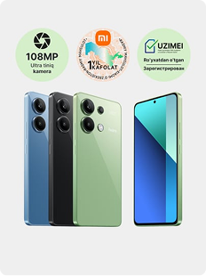
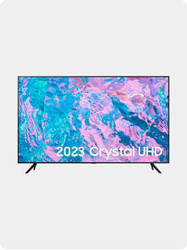
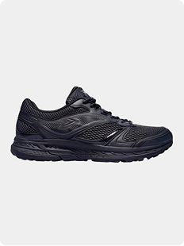
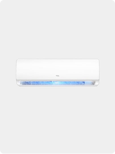
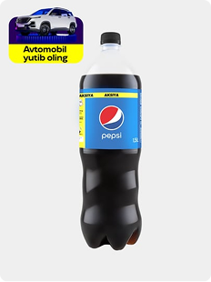
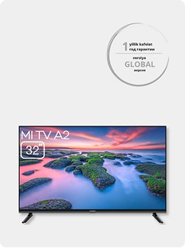
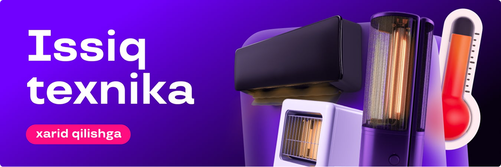

<p align="center">
  
</p>

<h1 align="center">Uzum Market - Figma dizayni asosida HTML, CSS va JavaScript internet-do'kon</h1>

<p align="center">
  <b>Figma to HTML, CSS, JavaScript</b> loyihasi: Figma dizaynidan kodga o'tkazilgan internet-do'kon sahifasi.<br>
  165 ta mahsulot, savat, sevimlilar, qidiruv va kategoriya bo'yicha saralash.
</p>

<p align="center">
  <a href="https://FOYDALANUVCHI.github.io/uzum-market/"></a>
</p>

<p align="center">
  
  
  
  
  
  
</p>

<p align="center">
  
</p>

---

## Mundarija

- [Loyiha haqida](#loyiha-haqida)
- [Figma dizayndan kodga](#figma-dizayndan-kodga)
- [Imkoniyatlar](#imkoniyatlar)
- [Rasmlar](#rasmlar)
- [Ishlatilgan texnologiyalar](#ishlatilgan-texnologiyalar)
- [Kursda o'rganilgan mavzular](#kursda-organilgan-mavzular)
- [Papkalar tuzilishi](#papkalar-tuzilishi)
- [Qanday ishga tushiriladi](#qanday-ishga-tushiriladi)
- [Kelajakda qo'shmoqchi bo'lganlarim](#kelajakda-qoshmoqchi-bolganlarim)
- [Kalit so'zlar](#kalit-sozlar)

## Loyiha haqida

**Uzum Market** - Figma'da chizilgan dizayn asosida **HTML, CSS va JavaScript** bilan yasalgan internet-do'kon (online shop) sahifasi. Loyihani JavaScript'ning 2 oylik kursida o'rganganlarimni mustahkamlash uchun yozdim.

Hamma mahsulot `mahsulotlar.json` faylida turadi va JavaScript uni o'qib, sahifaga chizadi. Ya'ni mahsulot qo'shish uchun HTML'ga tegish shart emas, JSON faylga yangi qator qo'shish yetadi.

## Figma dizayndan kodga

Bu loyiha **Figma to code** (Figma dizaynidan tayyor sahifa yasash) mashqi:

- Figma'dagi bosh sahifa tartibi bo'limlar ro'yxati sifatida kodga ko'chirilgan: 20 tadan "katta" bo'limlar va 5 tadan "qator" bo'limlar
- Ranglar, o'lchamlar va shriftlar (Inter, Roboto, Manrope) dizayndagidek tanlangan
- Karta, banner, savat oynasi va yuqori menyu alohida komponent kabi yozilgan
- Sahifa kompyuter, planshet va telefonga moslashgan (`@media`)

Agar siz ham Figma dizaynni HTML, CSS va JavaScript'ga o'tkazishni o'rganayotgan bo'lsangiz, bu loyiha sizga misol bo'la oladi.

## Imkoniyatlar

- 165 ta mahsulot, 24 ta bo'lim ko'rinishida
- Kategoriya bo'yicha saralash (bir xil kategoriyani qayta bossangiz, hammasi qaytadi)
- Mahsulot nomi bo'yicha qidiruv
- Savatga qo'shish, sonini ko'paytirish va kamaytirish, savatni tozalash
- Sevimlilarga qo'shish (yurakcha tugmasi)
- Jami narxni avtomatik hisoblash
- Savat va sevimlilar `localStorage` da saqlanadi, sahifani yangilasangiz ham o'chmaydi
- Telefon va planshetga moslashgan ko'rinish

## Rasmlar

Mahsulot rasmlari `images` papkasida turadi. Har bir mahsulotning rasmi `images/<id>.png` ko'rinishida olinadi, masalan 1-mahsulot uchun `images/1.png`.

<table>
  <tr>
    <td align="center"><br>Smartfon</td>
    <td align="center"><br>Televizor</td>
    <td align="center"><br>Krossovka</td>
  </tr>
  <tr>
    <td align="center"><br>Konditsioner</td>
    <td align="center"><br>Ichimlik</td>
    <td align="center"><br>Aqlli televizor</td>
  </tr>
</table>

Reklama bannerlari:

<p>
  
  
</p>

## Ishlatilgan texnologiyalar

| Texnologiya | Nima uchun |
| --- | --- |
| Figma | Dizayn manbasi |
| HTML | Sahifaning tuzilishi |
| CSS | Ko'rinish va telefonga moslash (`@media`) |
| JavaScript | Mahsulotlarni chizish, savat, sevimlilar, qidiruv |
| JSON | Mahsulotlar ro'yxati (`mahsulotlar.json`) |
| localStorage | Savat va sevimlilarni brauzerda saqlash |

## Kursda o'rganilgan mavzular

- Array metodlari: `map`, `filter`, `find`, `forEach`, `includes`, `indexOf`, `splice`, `join`
- DOM: `querySelector`, `createElement`, `appendChild`, `classList`, `innerHTML`, `addEventListener`
- `localStorage`, `JSON.stringify`, `JSON.parse`
- Destructuring va object'lar
- `fetch` bilan JSON faylni o'qish

## Papkalar tuzilishi

```
uzum-market/
├── index.html          sahifa tuzilishi
├── index.css           ko'rinish
├── app.js              asosiy JavaScript kodi
├── mahsulotlar.json    barcha mahsulotlar
├── images/             mahsulot rasmlari, banner va logotip
└── README.md           shu fayl
```

## Qanday ishga tushiriladi

Mahsulotlar `fetch` bilan o'qiladi, shuning uchun `index.html` ni ikki marta bosib ochsangiz mahsulotlar chiqmaydi. Sahifani server orqali ochish kerak.

**1-usul: Live Server (kompyuterda)**

1. Loyihani yuklab oling:

```powershell
git clone https://github.com/FOYDALANUVCHI/uzum-market.git
```

2. Papkani VS Code'da oching.
3. VS Code'ga **Live Server** qo'shimchasini o'rnating.
4. `index.html` ustida o'ng tugmani bosib, **Open with Live Server** ni tanlang.

**2-usul: GitHub Pages (internetda)**

1. Repo sahifasida **Settings** ga kiring.
2. Chap tomondan **Pages** ni tanlang.
3. **Branch** qismida `main` va `/ (root)` ni tanlab, **Save** ni bosing.
4. 1-2 daqiqadan keyin sayt `https://FOYDALANUVCHI.github.io/uzum-market/` manzilida ochiladi.

## Kelajakda qo'shmoqchi bo'lganlarim

- Mahsulot ustiga bosganda alohida sahifa ochish
- "Yana ko'rsatish" tugmasi bilan qo'shimcha mahsulotlarni chiqarish
- Kirish (login) oynasi
- Banner uchun bir nechta rasm va avtomatik almashish

## Kalit so'zlar

`figma` · `figma to html` · `figma to code` · `figma dizayn` · `html` · `css` · `javascript` · `frontend` · `internet do'kon` · `online shop` · `e-commerce` · `uzum market` · `uzum clone` · `savat` · `shopping cart` · `localstorage` · `json` · `fetch` · `responsive` · `o'zbekcha loyiha` · `o'quv loyiha`

---

<p align="center">Dasturlashni o'rganish yo'lidagi loyiha</p>
